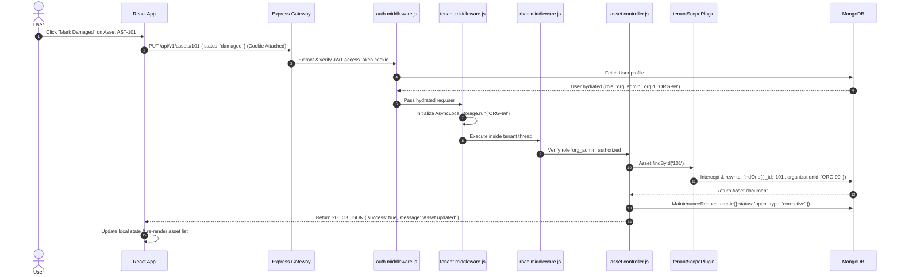

# 01. AssetIQ — System Master Overview

## 1. Executive Summary & Purpose of AssetIQ
**AssetIQ** is an enterprise-grade, multi-tenant SaaS Asset Management Platform engineered to track physical hardware infrastructure, automate custody assignments, manage equipment servicing lifecycles, calculate financial valuations, link warranty policies, and perform AI-driven health scoring and predictive failure analysis.

---

## 2. Business Problem & Industry Pain Points

### The Problem
Modern companies manage millions of dollars in IT hardware (laptops, servers, monitors) and office equipment (HVAC, furniture, vehicles). Traditional management relies on fragmented spreadsheets or basic inventory tracking software, creating four critical pain points:

1. **Ghost Assets & Offboarding Asset Loss:** When an employee leaves a company, assigned hardware is often forgotten or unreturned because HR and IT systems operate in silos.
2. **Unplanned Downtime & Reactive Repairs:** Equipment is serviced only after it breaks down, causing business disruption and inflated emergency repair costs.
3. **Multi-Tenant Data Leakage:** In SaaS environments, developers often forget to append tenant filters (`WHERE organization_id = ?`) in SQL/NoSQL queries, exposing organization A's private asset data to organization B.
4. **Data Privacy & AI Vendor Costs:** Third-party cloud AI solutions (e.g. OpenAI) require sending proprietary inventory data outside corporate boundaries and incur high per-token API charges.

### The AssetIQ Solution
- **Automated Offboarding Custody Guard:** Intercepts employee deletion attempts, listing assigned hardware and requiring a one-click return-to-stock workflow (`/offboarding/:empId/return-all`) before account removal.
- **Option B Event-Driven Servicing Lifecycle:** Automatically creates corrective maintenance tickets when hardware is marked damaged, transitions status when work begins, and restores custody state upon repair completion.
- **Zero-Leak Multi-Tenant Engine:** Uses Node.js `AsyncLocalStorage` and Mongoose schema plugins (`tenantScopePlugin`) to intercept and scope queries at the ORM layer automatically.
- **On-Premise AI Analytics:** Self-hosted local Ollama LLMs (`qwen2.5:3b` / `llama3.1:8b`) analyze age, servicing history, and costs locally without external data transfer or token fees.

---

## 3. Users & Target Persona Roles

```
                              ┌──────────────────────────────┐
                              │     super_admin (SaaS Owner) │
                              └──────────────┬───────────────┘
                                             │
                              ┌──────────────▼───────────────┐
                              │    org_admin (Company Admin) │
                              └──────────────┬───────────────┘
                                             │
                              ┌──────────────▼───────────────┐
                              │  asset_manager (Fleet Mgr)   │
                              └──────────────┬───────────────┘
                                             │
                              ┌──────────────▼───────────────┐
                              │     employee (End-User)      │
                              └──────────────────────────────┘
```

1. **Super Admin (`super_admin`):** SaaS platform owner. Provisions tenant organizations, creates subscription plans (`Free`, `Pro`, `Enterprise`), monitors platform analytics, and manages global announcement banners.
2. **Organization Admin (`org_admin`):** Root tenant administrator. Manages company users, departments, vendors, location hierarchies (`Branch` -> `Building` -> `Floor` -> `Room`), and offboarding workflows.
3. **Asset Manager (`asset_manager`):** Fleet supervisor. Registers physical hardware, assigns custody to staff, schedules preventive maintenance, resolves repairs, and inspects AI health reports.
4. **Employee (`employee`):** Staff custodian. Views assigned hardware, submits maintenance requests for broken devices, and chats in real time with technicians.

---

## 4. High-Level System Architecture

AssetIQ employs a decoupled single-page application (SPA) and REST API gateway architecture backed by WebSockets, MongoDB, and local LLMs.

```mermaid
graph TB
    subgraph Client Layer (Browser SPA)
        ReactApp[React 18 Single Page App]
        AuthCtx[AuthContext Provider]
        SocketCtx[SocketContext Provider]
    end

    subgraph Transport & Security Layer
        HTTP[HTTPS REST API Calls]
        WS[Socket.IO WebSockets Connection]
        Cookie[HttpOnly SameSite Cookie]
    end

    subgraph Backend Infrastructure (Node.js & Express)
        Server[Express Server port 5000]
        
        subgraph Pipeline Middlewares
            CORS[CORS Parser]
            AuthMW[Auth Middleware - verifyToken]
            TenantMW[Tenant Context Middleware - AsyncLocalStorage]
            RBACMW[RBAC Permission Guard]
        end
        
        subgraph Domain Controllers
            AuthCtrl[Auth Controller]
            AssetCtrl[Asset Controller]
            MaintCtrl[Maintenance Controller]
            AdminCtrl[Admin Controller]
            OffboardCtrl[Offboarding Controller]
        end

        subgraph Background Services & Engines
            CronJobs[Nightly AI 2AM & Daily Warranty 1AM Crons]
            AIService[4-Tier AI Engine - Cache -> Mock -> LLM 60s Timeout -> Fallback]
            SocketEngine[Socket.IO Real-Time Messaging & Room Manager]
        end
    end

    subgraph Data & Local AI Storage
        MongoDB[(MongoDB Multi-Tenant Database)]
        Ollama[Local Ollama LLM Service qwen2.5:3b / llama3.1:8b]
    end

    ReactApp --> AuthCtx & SocketCtx
    AuthCtx --> HTTP
    SocketCtx --> WS
    Cookie -.-> HTTP & WS
    
    HTTP --> Server
    WS --> SocketEngine
    
    Server --> CORS --> AuthMW --> TenantMW --> RBACMW
    RBACMW --> AuthCtrl & AssetCtrl & MaintCtrl & AdminCtrl & OffboardCtrl
    
    AssetCtrl & MaintCtrl --> AIService
    AIService --> Ollama
    AIService --> MongoosePlugin[Mongoose tenantScopePlugin]
    
    AuthCtrl & AssetCtrl & MaintCtrl & AdminCtrl & OffboardCtrl --> MongoosePlugin
    MongoosePlugin --> MongoDB
    
    CronJobs --> AIService & MongoDB
    MaintCtrl --> SocketEngine
```

---

## 5. Architectural Component Analysis (The 10 Master Questions)

### A. Frontend Layer (React 18 + Vite)
1. **What is it?** Single Page Application rendering dynamic UI components, handling routing, and managing global auth/socket state.
2. **Why is it needed?** Provides a responsive, real-time user dashboard without page reloads.
3. **Why was this approach chosen?** React 18's component reactivity and Vite's fast ESM bundler offer optimal performance and developer velocity.
4. **What problem does it solve?** Eliminates server-side template rendering latency and creates smooth, desktop-like user interactions.
5. **What would happen if this didn't exist?** Users would be forced to navigate multi-step HTML form reloads for every inventory update.
6. **How does it interact with the rest of the system?** Sends REST HTTP requests via `apiCall` wrapper and establishes WebSockets via `SocketContext`.
7. **Advantages:** High performance, component reusability, rich state management.
8. **Disadvantages:** Initial JS bundle download; requires client-side state synchronization.
9. **Common Mistakes:** Storing JWT tokens in `localStorage` (vulnerable to XSS) instead of `HttpOnly` cookies.
10. **Interview Question:** *How do you secure JWT token storage in a Single Page Application?*  
    *Answer:* Store tokens in `HttpOnly` `SameSite` cookies set by the backend server so client-side JavaScript cannot access them, eliminating XSS token theft.

### B. Multi-Tenant Context Engine (`AsyncLocalStorage` + `tenantScopePlugin`)
1. **What is it?** Thread-local execution context tracking active tenant IDs during HTTP requests and auto-scoping database queries.
2. **Why is it needed?** To isolate organization data in a shared multi-tenant database.
3. **Why was this approach chosen?** Eliminates manual `.where({ organizationId })` filters in controllers, preventing human error.
4. **What problem does it solve?** Completely prevents cross-tenant data leaks.
5. **What would happen if this didn't exist?** Forgetting a single filter in any query would expose company A's data to company B.
6. **How does it interact with the rest of the system?** Wrapped by `tenant.middleware.js` and consumed by `tenantScopePlugin` in Mongoose models.
7. **Advantages:** Zero boilerplate in controllers; zero chance of missing a tenant filter.
8. **Disadvantages:** Requires careful handling when global unscoped queries are explicitly intended (e.g. Super Admin operations).
9. **Common Mistakes:** Forgetting to handle unscoped global paths where `organizationId` is intentionally `null`.
10. **Interview Question:** *How do you implement zero-leak multi-tenancy without creating a separate database per tenant?*  
    *Answer:* Use Node.js `AsyncLocalStorage` to store the active tenant ID per request thread and attach an ORM pre-query hook that automatically injects `{ organizationId }` into all database operations.

---

## 6. Complete Request Lifecycle Flow


