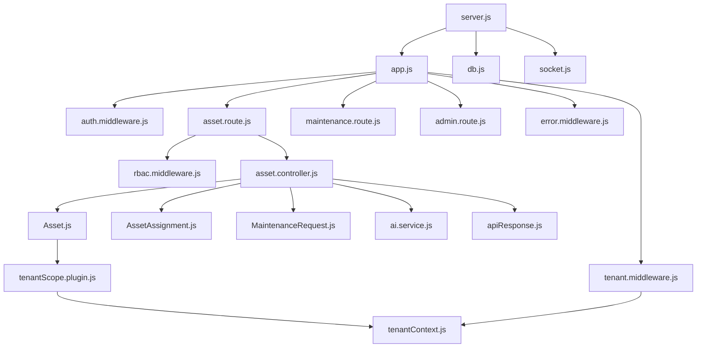

# 02. AssetIQ — Folder Structure & Module Communication Guide

## 1. Directory Tree & Architecture Overview

```
AssetIQ/
├── assetiq-backend/                  # Express REST & WebSocket API Gateway
│   ├── scripts/                      # System diagnostic & feature verification scripts
│   ├── src/                          # Backend source root
│   │   ├── config/                   # Infrastructure configuration & environment validation
│   │   ├── controllers/              # Domain HTTP request handlers & business logic
│   │   ├── jobs/                     # Automated background cron jobs
│   │   ├── middlewares/              # Express middleware pipeline (Auth, Tenant, RBAC, Error)
│   │   ├── models/                   # Mongoose schemas & data domain definitions
│   │   │   └── plugins/              # Reusable schema plugins (tenantScopePlugin)
│   │   ├── routes/                   # REST endpoint route definitions & middleware mapping
│   │   ├── services/                 # External service engines (AI analysis, QR generation)
│   │   └── utils/                    # Thread context tracking & response formatters
│   ├── app.js                        # Express app config, CORS, route mounts, global error handler
│   └── server.js                     # Server entry point, MongoDB connect, Socket.IO setup
│
└── assetiq-frontend/                 # Single Page React Application
    ├── src/
    │   ├── components/               # Modals, drawers, and UI components
    │   │   └── ui/                   # Reusable low-level form elements (CustomSelect)
    │   ├── context/                  # React Context global state (AuthContext, SocketContext)
    │   ├── views/                    # Top-level page views (Dashboard, Assets, Maintenance, etc.)
    │   ├── App.jsx                   # Root layout, role routing, navigation sidebar
    │   ├── index.css                 # Tailwind CSS & global styling tokens
    │   └── main.jsx                  # React DOM mounting entry point
```

---

## 2. Backend Folder Breakdown

### A. `assetiq-backend/src/config/`
1. **What is it?** Folder containing infrastructure setup, MongoDB connection parameters, Socket.IO initialization, and environment variable schema validation.
2. **Why is it needed?** Decouples server initialization and third-party connector configuration from business logic.
3. **Why was this approach chosen?** Ensures system prerequisites (database, environment variables) are validated before accepting incoming requests.
4. **What problem does it solve?** Prevents cryptic runtime crashes caused by missing `.env` parameters or unestablished database connections.
5. **What would happen if this didn't exist?** Database configuration and environment parsing would be duplicated across multiple controller files.
6. **How does it interact with the rest of the system?** Imported by `server.js` on startup to initialize connections used across all models and controllers.
7. **Advantages:** Centralized setup, fail-fast startup behavior, clean configuration boundaries.
8. **Disadvantages:** Changes to configuration schemas require server restart.
9. **Common Mistakes:** Hardcoding secret keys or database connection strings directly inside configuration files instead of reading environment variables.
10. **Interview Question:** *How do you ensure required environment variables are present before starting a Node.js application?*  
    *Answer:* Use Zod or a validation library in an environment config module to parse and validate `process.env` on server startup, exiting the process immediately if validation fails.

#### Files in `config/`:
- **`db.js`**: Connects Mongoose to MongoDB using `MONGODB_URI`.
- **`env.js`**: Uses Zod to parse and validate process environment variables (`PORT`, `MONGODB_URI`, `JWT_ACCESS_SECRET`, `MOCK_AI`, `OLLAMA_URL`).
- **`socket.js`**: Initializes Socket.IO server, authenticates connection handshakes via JWT cookies, and manages user (`user:<id>`), org (`org:<id>`), and chat (`chat:request:<id>`) rooms.

---

### B. `assetiq-backend/src/controllers/`
1. **What is it?** Folder containing business logic handlers for HTTP requests.
2. **Why is it needed?** Isolates request handling and response formatting from routing and data storage code.
3. **Why was this approach chosen?** Follows the Model-View-Controller (MVC) architectural pattern.
4. **What problem does it solve?** Prevents bloated route files and keeps business logic reusable and testable.
5. **What would happen if this didn't exist?** Route files would contain hundreds of lines of inline handler logic.
6. **How does it interact with the rest of the system?** Called by route handlers in `src/routes/`, queries Mongoose models in `src/models/`, calls domain services in `src/services/`, and returns responses via `sendResponse`.
7. **Advantages:** Separates HTTP transport concerns from business logic; facilitates unit testing.
8. **Disadvantages:** Requires maintaining matching controller and route files.
9. **Common Mistakes:** Putting database query building or password hashing directly inside controllers instead of delegating to models/services.
10. **Interview Question:** *What is the role of a controller in an Express MVC architecture?*  
    *Answer:* A controller receives HTTP requests from the router, validates input, calls business domain services or database models, and dispatches standardized HTTP responses.

#### Important Files in `controllers/`:
- **`auth.controller.js`**: Handles login, token refresh, `/auth/me` user hydration, and logout.
- **`asset.controller.js`**: Manages asset CRUD, custody assignment, "Mark Damaged" auto-ticket triggers, and hard-delete safety checks.
- **`maintenance.controller.js`**: Manages maintenance ticket lifecycle, work commencement status updates, technician assignment, repair resolution logging, and REST chat message fetch.
- **`admin.controller.js`**: Super Admin operations for tenant organization provisioning, subscription plan management, and Org Admin user creation.
- **`offboarding.controller.js`**: Manages assigned employee asset checks and bulk return-to-stock operations upon staff exit.

---

### C. `assetiq-backend/src/middlewares/`
1. **What is it?** Express middleware functions executed sequentially during the request pipeline.
2. **Why is it needed?** Cross-cutting concerns like authentication, multi-tenant isolation, role authorization, and error handling must run before controllers execute.
3. **Why was this approach chosen?** Express middleware pipeline allows modular, chainable request processing.
4. **What problem does it solve?** Eliminates repetitive authentication and permission check boilerplate inside individual controller functions.
5. **What would happen if this didn't exist?** Every single controller function would have to manually verify JWT tokens, inspect tenant permissions, and handle try-catch errors.
6. **How does it interact with the rest of the system?** Mounted in `app.js` and `src/routes/` to intercept requests before they reach controllers.
7. **Advantages:** Highly reusable, chainable pipeline, single point of enforcement for security controls.
8. **Disadvantages:** Incorrect middleware order can introduce security bypasses (e.g. running tenant middleware before auth middleware).
9. **Common Mistakes:** Forgetting to call `next()` or `next(error)` in middleware, causing hanging HTTP requests.
10. **Interview Question:** *Why is middleware ordering critical in Express?*  
    *Answer:* Express executes middleware sequentially in the order defined. Authentication must run first to populate user identity, followed by tenant isolation to set context, followed by role authorization before reaching the target route handler.

#### Files in `middlewares/`:
- **`auth.middleware.js`**: `protect` middleware extracts JWT from cookie/header, verifies signature, and attaches `req.user`.
- **`tenant.middleware.js`**: `tenantScope` middleware extracts `req.user.organizationId` and initializes `AsyncLocalStorage` context.
- **`rbac.middleware.js`**: `requireRole(...roles)` guard checks if `req.user.role` matches authorized roles.
- **`error.middleware.js`**: `errorHandler` global error middleware converts exceptions into standardized JSON responses.

---

## 3. Folder Dependency Graph


