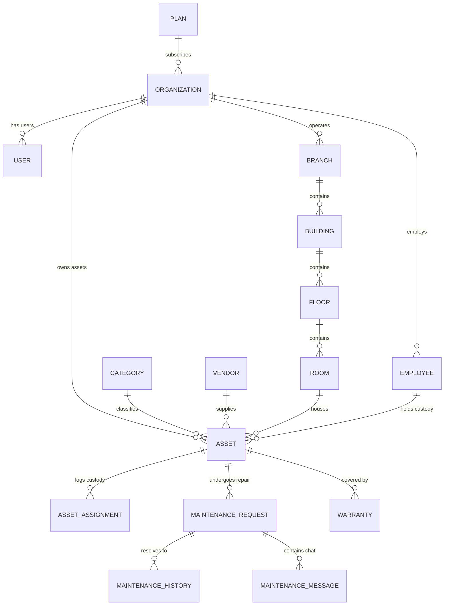

# 03. AssetIQ — Data Storage & Multi-Tenant Isolation Guide

## MongoDB Collections Overview

| Collection Name | Mongoose Model | Primary Purpose | Indexed Fields |
| :--- | :--- | :--- | :--- |
| `organizations` | `Organization.js` | SaaS tenant accounts | `code` (unique), `status` |
| `plans` | `Plan.js` | Subscription tiers | `name` (unique) |
| `users` | `User.js` | User authentication & role profile | `email` (unique), `organizationId` |
| `employees` | `Employee.js` | Staff directory for custody assignment | `organizationId`, `email` |
| `assets` | `Asset.js` | Physical assets inventory | `assetCode` (unique), `organizationId`, `status`, `assignedTo` |
| `assetassignments` | `AssetAssignment.js` | Custody history log | `assetId`, `employeeId`, `organizationId` |
| `maintenancerequests` | `MaintenanceRequest.js` | Servicing and repair tickets | `assetId`, `organizationId`, `status` |
| `maintenancehistories` | `MaintenanceHistory.js` | Completed repair logs & costs | `assetId`, `requestId`, `organizationId` |
| `maintenancemessages` | `MaintenanceMessage.js` | Ticket real-time chat messages | `requestId`, `senderId`, `organizationId` |
| `warranties` | `Warranty.js` | Warranty contracts attached to assets | `assetId`, `organizationId`, `endDate` |
| `branches` | `Branch.js` | Site locations | `organizationId` |
| `buildings` | `Building.js` | Buildings within a Branch | `branchId`, `organizationId` |
| `floors` | `Floor.js` | Floors within a Building | `buildingId`, `organizationId` |
| `rooms` | `Room.js` | Rooms on a Floor | `floorId`, `organizationId` |

---

## Entity Relationships (ERD)



---

## Multi-Tenant Data Isolation Strategy

Data isolation in AssetIQ is achieved at the database access layer without requiring manual `.where({ organizationId })` on every controller query:

```
Request Stream
      │
      ▼
tenant.middleware.js ──> Extract req.user.organizationId
      │
      ▼
tenantContext.js ──────> Store in AsyncLocalStorage thread-local store
      │
      ▼
tenantScopePlugin ─────> Mongoose Pre-Hook intercepts queries
      │                  Appends { organizationId: tenantId } automatically
      ▼
MongoDB Query ─────────> Returns ONLY records belonging to active tenant
```

### Key Technical Components:
1. **`AsyncLocalStorage` Context (`src/utils/tenantContext.js`):** Maintains a thread-local execution context for each incoming HTTP request thread.
2. **`tenantScope` Middleware (`src/middlewares/tenant.middleware.js`):** Wraps request execution inside `runWithTenant(orgId, callback)`.
3. **`tenantScopePlugin` (`src/models/plugins/tenantScope.plugin.js`):** Intercepts Mongoose query methods (`find`, `findOne`, `updateOne`, `deleteMany`, `countDocuments`) and injects `{ organizationId: activeTenantId }`.
