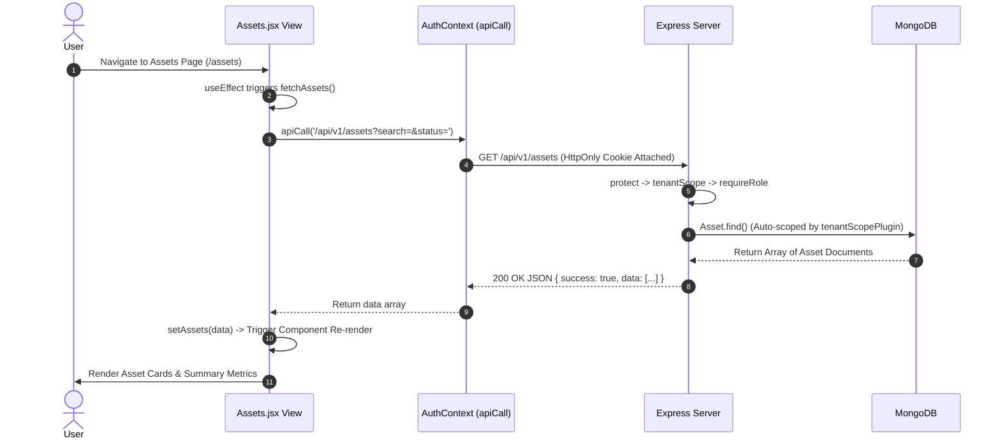

# 03. AssetIQ — Frontend Architecture & React Guide

## 1. React Architecture & Provider Tree

The frontend is a Single Page Application (SPA) built with **React 18** and **Vite**. Global application state, authentication sessions, and real-time WebSockets are managed through React Context Providers wrapped around the root component tree.

```mermaid
graph TD
    A[main.jsx Mount Root] --> B[AuthProvider Context]
    B --> C[SocketProvider Context]
    C --> D[App.jsx Layout & Router]
    
    D -->|Path: /login or /register| PublicAuth[Login.jsx / Register.jsx]
    D -->|Path: / (Unauthenticated)| Landing[LandingPage.jsx]
    
    D -->|Authenticated super_admin| SuperAdminView[SuperAdmin.jsx]
    
    D -->|Authenticated Tenant User| MainLayout[Sidebar Navigation + Header Layout]
    MainLayout --> Dashboard[Dashboard.jsx]
    MainLayout --> Assets[Assets.jsx]
    MainLayout --> Locations[Locations.jsx]
    MainLayout --> Maintenance[Maintenance.jsx]
    MainLayout --> Warranties[Warranties.jsx]
    MainLayout --> Reports[Reports.jsx]
    MainLayout --> OrgSetup[OrganizationSetup.jsx]
```

---

## 2. Core Frontend Components & Contexts (The 10 Master Questions)

### A. `AuthContext.jsx` (`src/context/AuthContext.jsx`)
1. **What is it?** Global React Context provider managing user authentication state (`user`, `loading`), login/logout actions, and session token refreshes.
2. **Why is it needed?** Provides centralized authentication state accessible by any component in the application without prop drilling.
3. **Why was this approach chosen?** React Context API provides clean, native global state management without external library overhead (e.g. Redux).
4. **What problem does it solve?** Eliminates prop-drilling authentication details through every level of the component tree and handles automatic 401 token refresh silently.
5. **What would happen if this didn't exist?** Every component would have to manually fetch user session state and handle 401 token expiration errors independently.
6. **How does it interact with the rest of the system?** Wraps the entire application, provides the `useAuth()` hook, and exposes the custom `apiCall` fetch wrapper.
7. **Advantages:** Centralized session management, automatic token refresh, clean custom hook API.
8. **Disadvantages:** Re-rendering consumers when user context state updates (mitigated by memoization).
9. **Common Mistakes:** Storing JWT tokens in component state or `localStorage` instead of leveraging browser `HttpOnly` cookies with `credentials: 'include'`.
10. **Interview Question:** *How does your `apiCall` wrapper handle expired JWT access tokens seamlessly?*  
    *Answer:* `apiCall` wraps `fetch` with `credentials: 'include'`. When an API request returns a `401 Unauthorized` status, `apiCall` catches the 401, sends a `POST /auth/refresh` request to obtain a fresh access token cookie, and transparently retries the original failed request.

---

### B. `SocketContext.jsx` (`src/context/SocketContext.jsx`)
1. **What is it?** React Context provider managing the Socket.IO WebSocket client connection lifecycle.
2. **Why is it needed?** Enables real-time bidirectional communication between client and server for live maintenance chat and push notifications.
3. **Why was this approach chosen?** WebSockets maintain a persistent TCP connection, avoiding polling overhead.
4. **What problem does it solve?** Eliminates expensive client-side HTTP polling intervals for chat messages and notifications.
5. **What would happen if this didn't exist?** Maintenance chat would require constant HTTP polling, causing network lag and high server overhead.
6. **How does it interact with the rest of the system?** Connects to `http://localhost:5000` with `withCredentials: true`, authenticates via JWT cookie, and exposes the socket instance via `useSocket()`.
7. **Advantages:** Instant message delivery, low latency, automatic server room joins (`user:<id>`, `org:<id>`).
8. **Disadvantages:** Requires handling connection loss and manual socket room cleanup on unmount.
9. **Common Mistakes:** Forgetting to unmount event listeners (`socket.off('chat:message')`) inside React `useEffect` cleanup functions, creating duplicate listener leaks.
10. **Interview Question:** *How do you prevent duplicate message listeners when using Socket.IO in React components?*  
    *Answer:* Inside the `useEffect` hook, return a cleanup function that explicitly calls `socket.off('event_name', handler)` when the component unmounts or dependencies change.

---

### C. `OffboardingChecklistModal.jsx` (`src/components/OffboardingChecklistModal.jsx`)
1. **What is it?** Modal component displaying an exiting employee's assigned assets and executing a bulk return-to-stock workflow.
2. **Why is it needed?** Prevents orphaned "ghost" assets when an employee leaves an organization.
3. **Why was this approach chosen?** Integrates directly into the employee deletion flow, forcing administrators to acknowledge and return custody before deletion.
4. **What problem does it solve?** Solves asset loss during staff exit by ensuring 100% of assigned hardware is unassigned and marked `'available'`.
5. **What would happen if this didn't exist?** Deleting an employee would leave assigned assets referencing non-existent employee ObjectIds in MongoDB.
6. **How does it interact with the rest of the system?** Triggered by `OrganizationSetup.jsx` when an employee deletion attempt returns a `400 Bad Request` assigned asset error. Executes `POST /api/v1/offboarding/:empId/return-all` followed by `DELETE /api/v1/lookups/employees/:empId`.
7. **Advantages:** Bulletproof asset recovery, clean UX checklist, automated multi-step execution.
8. **Disadvantages:** Requires two sequential API calls to complete deletion.
9. **Common Mistakes:** Attempting to force-delete the employee record without first returning assigned hardware.
10. **Interview Question:** *How do you handle relational integrity constraints in NoSQL databases during entity deletion?*  
    *Answer:* Pre-flight query dependent collections before deletion. If references exist, block deletion and execute a workflow (or transaction) to reassign/unassign dependent references before completing deletion.

---

## 3. Data Fetching & UI Render Flow


