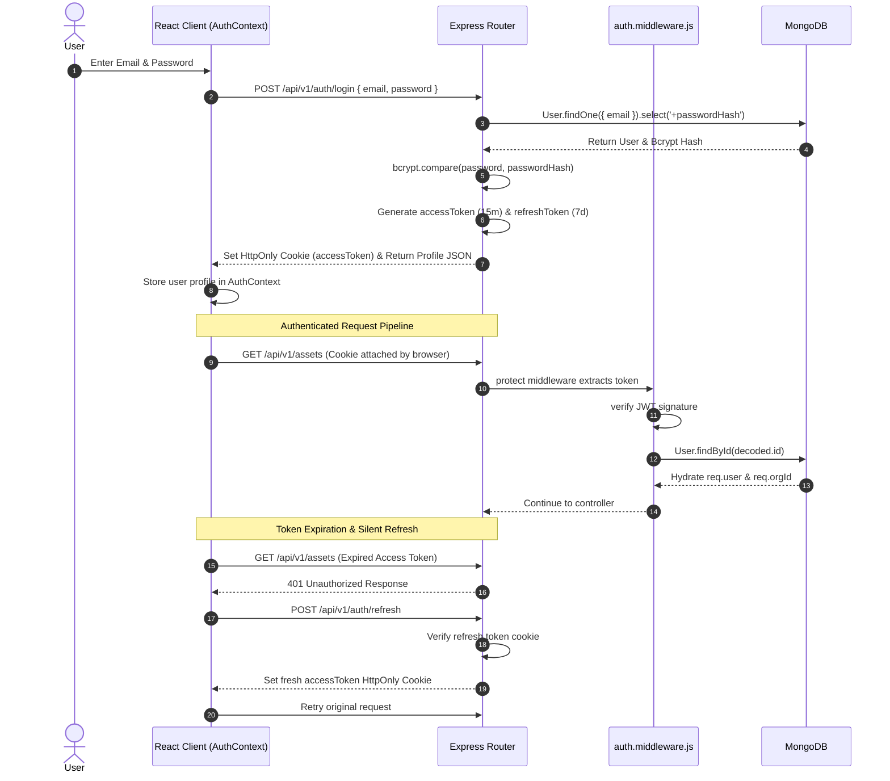

# 04. AssetIQ — Authentication & Security Architecture

## Authentication Protocol & Token Lifecycle
AssetIQ uses a dual-token JWT authentication architecture stored in `HttpOnly` `SameSite` cookies to protect against XSS token theft and CSRF attacks.

---

## Security & Authorization Middlewares

### 1. `protect` Middleware (`src/middlewares/auth.middleware.js`)
- Extracts JWT from `accessToken` HTTP-only cookie or `Authorization: Bearer <token>` header.
- Verifies signature against `JWT_ACCESS_SECRET`.
- Confirms user account status is `active`.
- Attaches `req.user` and `req.orgId` to the request object.

### 2. `tenantScope` Middleware (`src/middlewares/tenant.middleware.js`)
- Reads `req.user.organizationId`.
- Invokes `runWithTenant(orgId, async () => next())` to establish thread-local tenant tracking via `AsyncLocalStorage`.

### 3. `requireRole` Middleware (`src/middlewares/rbac.middleware.js`)
- Enforces Role-Based Access Control (RBAC).
- Accepts allowed roles (`requireRole('org_admin', 'asset_manager')`).
- Compares `req.user.role` against authorized list, returning `403 Forbidden` if unauthorized.

---

## Password Hashing & Encryption
- Passwords are hashed using `bcryptjs` with a cost factor of 10 salt rounds prior to persistence in MongoDB.
- Mongoose schema marks `passwordHash` with `select: false` so hashes are never accidentally returned in query results unless explicitly selected (`.select('+passwordHash')`).
