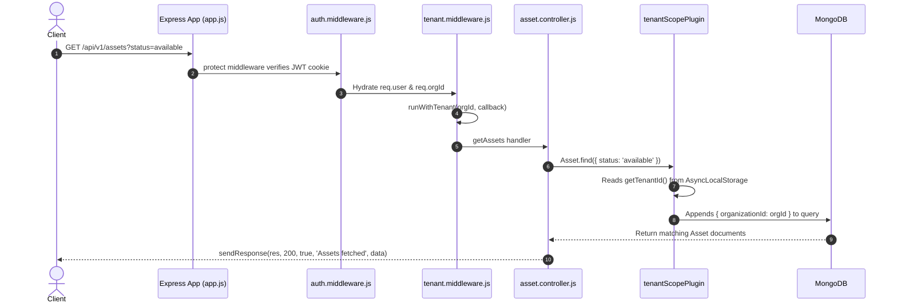

# 04. AssetIQ — Backend Architecture & Express Guide

## 1. Express Pipeline Architecture & Request Execution Order

The backend is built on **Node.js** and **Express.js** with an event-driven, non-blocking I/O execution loop. Requests pass through a strict, sequential middleware pipeline before reaching route controllers.

```mermaid
flowchart TD
    ClientReq[Incoming HTTP Request] --> ExpressServer[server.js / app.js]
    
    subgraph Stage 1: Security & Transport Parsers
        ExpressServer --> CORS[CORS Middleware - Credentials Allowed]
        CORS --> CookieParser[Cookie Parser Middleware]
        CookieParser --> JSONParser[Express JSON Body Parser]
    end
    
    subgraph Stage 2: Authentication & Context Isolation
        JSONParser --> AuthMW[auth.middleware.js - protect]
        AuthMW --> VerifyJWT{Verify JWT Cookie}
        VerifyJWT -- Invalid/Expired --> Return401[Return 401 Unauthorized]
        VerifyJWT -- Valid --> HydrateUser[Attach req.user & req.orgId]
        
        HydrateUser --> TenantMW[tenant.middleware.js - tenantScope]
        TenantMW --> AsyncLocalStore[runWithTenant AsyncLocalStorage Store]
    end
    
    subgraph Stage 3: Authorization & Validation
        AsyncLocalStore --> RBACMW[rbac.middleware.js - requireRole]
        RBACMW -- Role Unauthorized --> Return403[Return 403 Forbidden]
        RBACMW -- Role Authorized --> Controller[Execute Controller Handler]
        Controller --> ZodValidation{Zod Schema Validation}
        ZodValidation -- Invalid --> Return400[Return 400 Bad Request]
    end
    
    subgraph Stage 4: Database ORM Execution
        ZodValidation -- Valid --> MongooseCall[Mongoose Model Operation]
        MongooseCall --> TenantPlugin[tenantScopePlugin appends organizationId]
        TenantPlugin --> MongoDB[(MongoDB Database)]
    end
    
    subgraph Stage 5: Response & Error Catch
        MongoDB --> ControllerSuccess[sendResponse 200/201 JSON]
        Controller -- Exception Thrown --> ErrorMW[error.middleware.js - Central Error Handler]
        ErrorMW --> FormattedError[Return Standardized JSON Error]
```

---

## 2. Core Backend Modules & Files (The 10 Master Questions)

### A. `server.js` (Server Bootstrap)
1. **What is it?** Entry point script for the HTTP server, MongoDB connection, Socket.IO server mount, and cron job initialization.
2. **Why is it needed?** Bootstraps the backend runtime environment, listening on port 5000.
3. **Why was this approach chosen?** Separates server initialization (port listening, WebSockets, DB connect) from Express route declarations (`app.js`).
4. **What problem does it solve?** Enables clean integration testing without spinning up actual TCP ports.
5. **What would happen if this didn't exist?** Server initialization and route declarations would be mixed together, complicating test setups.
6. **How does it interact with the rest of the system?** Imports `app.js`, connects Mongoose via `db.js`, seeds initial data, starts background cron jobs, and attaches Socket.IO.
7. **Advantages:** Clean architectural entry point, modular server startup.
8. **Disadvantages:** Server configuration changes require restart.
9. **Common Mistakes:** Placing route handlers directly inside `server.js`.
10. **Interview Question:** *Why separate `app.js` from `server.js` in Node.js applications?*  
    *Answer:* To decouple Express route configuration from HTTP/TCP server creation, allowing Supertest integration tests to import `app.js` without binding to physical network ports.

---

### B. `error.middleware.js` (`src/middlewares/error.middleware.js`)
1. **What is it?** Global Express error handling middleware (`(err, req, res, next)`).
2. **Why is it needed?** Catches unhandled exceptions thrown across controllers and formats standardized JSON error responses.
3. **Why was this approach chosen?** Centralized error mapping prevents uncaught exceptions from crashing Node.js or returning raw stack traces to users.
4. **What problem does it solve?** Maps Zod validation errors, Mongoose 11000 duplicate keys, and JWT errors to appropriate HTTP status codes (400, 401, 403, 500).
5. **What would happen if this didn't exist?** Unhandled errors would return HTML stack traces in development or hang execution.
6. **How does it interact with the rest of the system?** Mounted at the very end of `app.js` after all route definitions (`app.use(errorHandler)`).
7. **Advantages:** Consistent API error response contract across all endpoints.
8. **Disadvantages:** Must be placed after all route mounts to catch errors passed to `next(err)`.
9. **Common Mistakes:** Defining `errorHandler` with fewer than 4 arguments (`err, req, res, next`), causing Express to treat it as a standard middleware.
10. **Interview Question:** *How does Express distinguish error-handling middleware from standard middleware?*  
    *Answer:* Express identifies error-handling middleware by its function arity: it must take exactly four parameters `(err, req, res, next)`.

---

## 3. Database Query & Controller Execution Flow


