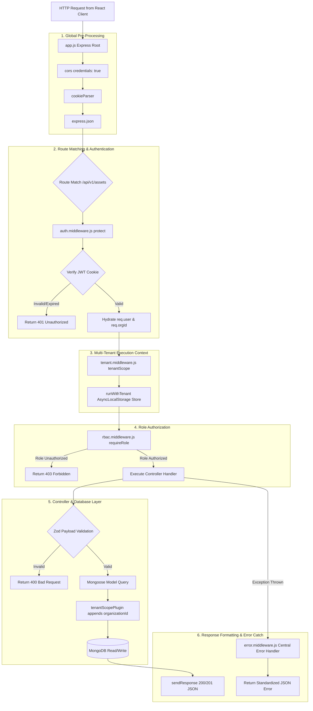

# 05. AssetIQ — Backend Request Processing Lifecycle

## Express Middleware Pipeline Execution Order



---

## Detailed Step-by-Step Request Lifecycle

1. **Incoming Request:** Client sends HTTP request (e.g. `POST /api/v1/assets`). Browser automatically includes the HTTP-only `accessToken` cookie.
2. **Body & Cookie Parsing:** Express runs `cookieParser()` to populate `req.cookies` and `express.json()` to parse payload JSON into `req.body`.
3. **JWT Verification:** `protect` middleware extracts `accessToken`, verifies its cryptographic signature using `JWT_ACCESS_SECRET`, fetches the matching user document from MongoDB, and attaches it to `req.user`.
4. **Tenant Context Initialization:** `tenantScope` middleware extracts `req.user.organizationId` and calls `runWithTenant(orgId, async () => next())`, initializing Node.js `AsyncLocalStorage`.
5. **RBAC Permission Verification:** `requireRole('org_admin', 'asset_manager')` checks `req.user.role`. If authorized, execution proceeds.
6. **Controller Logic Execution:** Controller validates inputs using Zod schemas (`createAssetSchema.parse(req.body)`).
7. **ORM Database Interaction:** Mongoose model methods (`Asset.create(...)`) are intercepted by `tenantScopePlugin`, which automatically attaches `organizationId` from `AsyncLocalStorage`.
8. **Response Dispatch:** Controller invokes `sendResponse(res, 201, true, 'Asset created', asset)`, returning standard JSON structure:
   ```json
   {
     "success": true,
     "message": "Asset created",
     "data": { ... }
   }
   ```
