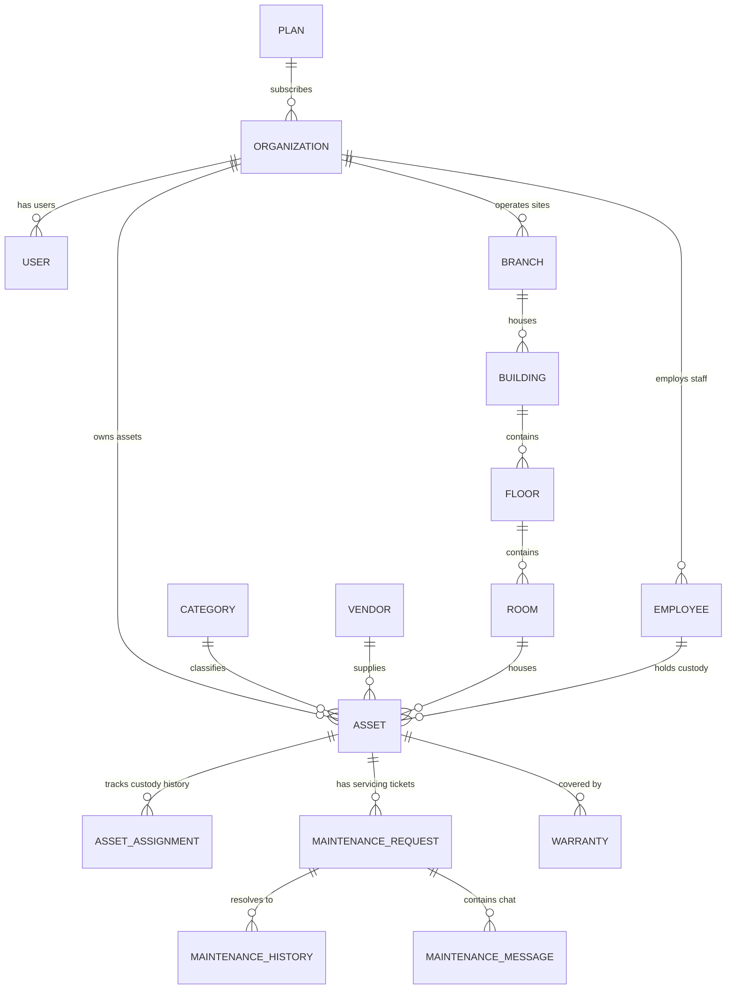

# 05. AssetIQ — Database Architecture & Mongoose Guide

## 1. Why MongoDB & Mongoose? (The 10 Master Questions)

### A. MongoDB Document Database
1. **What is it?** A distributed, document-oriented NoSQL database storing data as JSON-like BSON (Binary JSON) documents.
2. **Why is it needed?** Stores physical asset records with dynamic, evolving attributes (laptops vs vehicles vs software licenses).
3. **Why was this approach chosen?** Offers high read/write performance, flexible document schemas, and horizontal scaling capabilities.
4. **What problem does it solve?** Solves rigid relational SQL table migration overhead when adding new asset attributes or telemetry metrics.
5. **What would happen if this didn't exist?** Adding a new hardware property would require complex SQL schema migrations (`ALTER TABLE`) and database locks.
6. **How does it interact with the rest of the system?** Interfaced via Mongoose ORM models in `src/models/`.
7. **Advantages:** Flexible schema, fast JSON serialization, native indexing, powerful aggregation pipelines.
8. **Disadvantages:** Lacks automatic multi-table foreign key constraints (handled at application/ORM layer).
9. **Common Mistakes:** Storing unbounded arrays inside a single document (e.g. storing 10,000 maintenance logs directly in an asset document instead of referencing a separate `MaintenanceHistory` collection).
10. **Interview Question:** *How do MongoDB ObjectIds work and why are they 12 bytes?*  
    *Answer:* A 12-byte BSON ObjectId consists of a 4-byte timestamp (creation time), a 5-byte random value (machine/process identifier), and a 3-byte incrementing counter, guaranteeing global uniqueness without a centralized authority.

---

## 2. Complete Entity Relationship Diagram (ERD)



---

## 3. Schema & Collection Details

### A. `assets` Collection (`src/models/Asset.js`)
- **Purpose:** Primary registry for organizational hardware assets.
- **Key Fields:**
  - `organizationId`: String (Indexed by `tenantScopePlugin`).
  - `assetCode`: String (Unique index, e.g. `AST-LAP-001`).
  - `name`: String (Required).
  - `categoryId`: ObjectId ref `Category`.
  - `roomId`: ObjectId ref `Room`.
  - `vendorId`: ObjectId ref `Vendor`.
  - `assignedTo`: ObjectId ref `Employee` (Nullable).
  - `status`: String enum (`available`, `assigned`, `damaged`, `under_maintenance`, `retired`).
  - `ai`: Object storing `healthScore`, `failureRiskPercent`, `insights`, `predictedNextMaintenanceDate`, `remainingUsefulLifeMonths`, `lastAnalyzedAt`.
- **Pre-hooks & Plugins:** Registers `tenantScopePlugin` for automatic tenant isolation.

### B. `users` Collection (`src/models/User.js`)
- **Purpose:** Auth credentials and user authorization profiles.
- **Key Fields:**
  - `organizationId`: String (Nullable for `super_admin`).
  - `email`: String (Unique, required).
  - `passwordHash`: String (Selected `false` by default).
  - `role`: String enum (`super_admin`, `org_admin`, `asset_manager`, `employee`).
  - `employeeRef`: ObjectId ref `Employee` (Nullable).
- **Pre-save Hook:** Automatically hashes password with `bcryptjs` if modified.

---

## 4. Population & Reference Queries
Mongoose population (`.populate('assignedTo categoryId roomId')`) replaces foreign key ObjectIds with their target document data during database query execution:

```javascript
const asset = await Asset.findById(id)
  .populate('categoryId', 'name')
  .populate('assignedTo', 'firstName lastName email')
  .populate('roomId', 'name');
```
