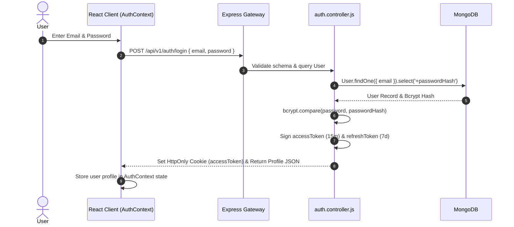
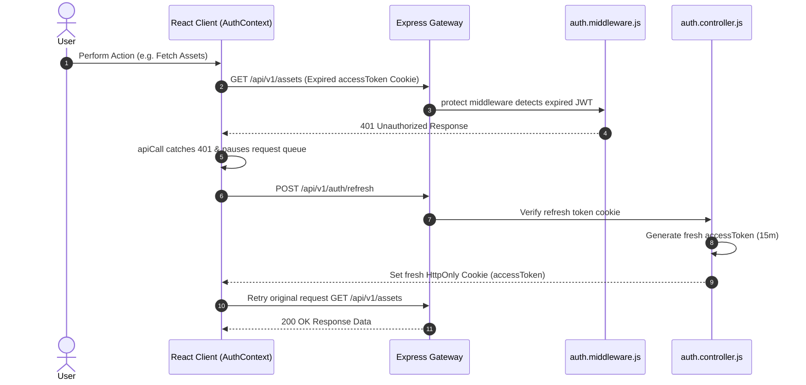

# 06. AssetIQ — Complete Authentication & Security Guide

## 1. Authentication Strategy & Token Mechanics (The 10 Master Questions)

### A. Dual-Token Architecture (`accessToken` + `refreshToken`)
1. **What is it?** A security model combining short-lived Access Tokens (15 minutes) and long-lived Refresh Tokens (7 days) signed with JSON Web Tokens (JWT).
2. **Why is it needed?** Limits the exposure window if an access token is compromised while providing a seamless user session without requiring frequent re-logins.
3. **Why was this approach chosen?** Offers optimal security compared to static long-lived tokens while enabling instant token revocation.
4. **What problem does it solve?** Solves session theft and user friction by silently renewing access tokens in the background via `AuthContext.jsx`.
5. **What would happen if this didn't exist?** Users would either be forced to log in every 15 minutes or face security vulnerabilities from non-expiring tokens.
6. **How does it interact with the rest of the system?** Tokens are issued by `auth.controller.js`, stored in HTTP-only cookies, verified by `auth.middleware.js`, and refreshed automatically by `AuthContext.jsx`.
7. **Advantages:** High security, zero client-side token management logic, immune to XSS token theft when stored in `HttpOnly` cookies.
8. **Disadvantages:** Requires maintaining a refresh token endpoint and cookie handling logic.
9. **Common Mistakes:** Storing JWT tokens in `localStorage` or `sessionStorage` (making them vulnerable to XSS scripts).
10. **Interview Question:** *Why store JWT tokens in `HttpOnly` cookies instead of `localStorage`?*  
    *Answer:* `localStorage` is accessible to any client-side JavaScript script executing on the page (vulnerable to XSS attacks). `HttpOnly` cookies are isolated by the browser engine and cannot be read or stolen by JavaScript.

---

## 2. Authentication Sequence Diagrams

### A. Login & Token Cookie Set Flow

---

### B. Automatic Silent Token Refresh Flow

---

## 3. Role-Based Access Control (RBAC) Matrix

| User Role | Managed Scope | Permitted API Endpoints |
| :--- | :--- | :--- |
| `super_admin` | Global SaaS Platform | `/api/v1/admin/*` (Tenant provisioning, subscription plans, platform tickets, system banners) |
| `org_admin` | Tenant Workspace | `/api/v1/lookups/*`, `/api/v1/locations/*`, `/api/v1/offboarding/*`, `/api/v1/assets/*`, `/api/v1/maintenance/*` |
| `asset_manager` | Fleet Inventory & Repairs | `/api/v1/assets/*` (Register, Assign, Mark Damaged), `/api/v1/maintenance/*` (Schedule, Complete) |
| `employee` | Personal Assigned Custody | Read assigned assets, submit servicing requests, participate in ticket chats |
