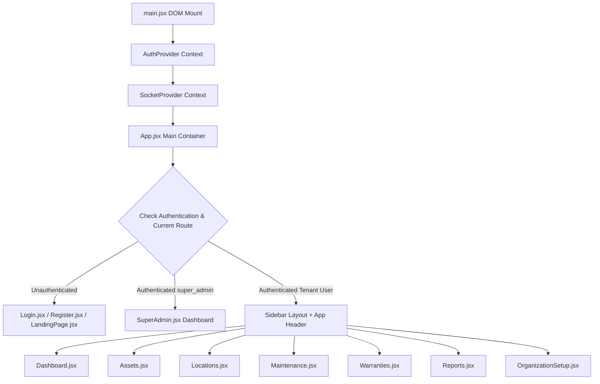

# 06. AssetIQ — Frontend React Architecture & Flow

## Application Mounting & Provider Tree

---

## Global Context API Infrastructure

### 1. `AuthContext.jsx`
- **State Managed:** `user`, `loading`, `error`.
- **Session Check:** On initial app mount, executes `GET /api/v1/auth/me` to verify session cookies and hydrate user state.
- **`apiCall` HTTP Client Wrapper:**
  - Wraps native `fetch` requests with `credentials: 'include'` to send and receive HTTP-only cookies.
  - Automatically intercepts `401 Unauthorized` responses and attempts a silent token refresh via `POST /api/v1/auth/refresh`.
  - Retries the failed request upon successful refresh, or redirects to `/login` if refresh fails.

### 2. `SocketContext.jsx`
- **Connection Management:** Establishes Socket.IO connection to `http://localhost:5000` with `withCredentials: true`.
- **Event Listeners:** Listens for real-time notification events (`notification:new`) and maintenance chat events (`chat:message`).

---

## Component Communication & Modal State Management
- **Backdrop Overlay Click-to-Close:** All interactive modals (`EmployeeSelfServiceModal.jsx`, `OffboardingChecklistModal.jsx`, `MaintenanceChatDrawer.jsx`, `Assets.jsx` edit modals) implement outer backdrop overlay click handlers with `e.stopPropagation()` on inner containers.
- **Custom Searchable Select:** [`CustomSelect.jsx`](file:///C:/Projects/AssetIQ/assetiq-frontend/src/components/ui/CustomSelect.jsx) provides keyboard search filtering, dynamic dropdown positioning, and ARIA accessibility support across form views.
