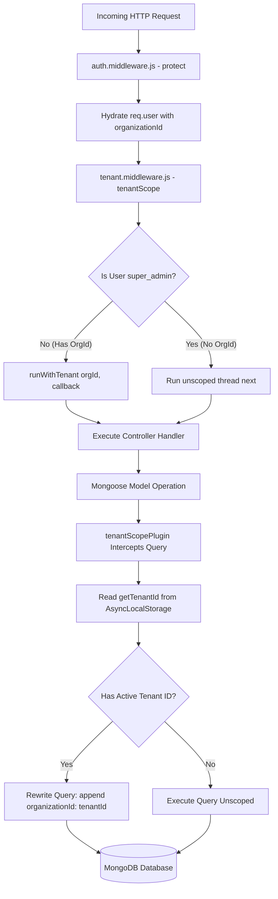

# 07. AssetIQ — Zero-Leak Multi-Tenancy Engine

## 1. Why Multi-Tenancy Architecture Matters (The 10 Master Questions)

### A. Thread-Local Multi-Tenant Isolation
1. **What is it?** A zero-leak multi-tenant engine utilizing Node.js `AsyncLocalStorage` and Mongoose pre-query hooks to scope database queries automatically.
2. **Why is it needed?** To isolate organization data in a shared multi-tenant SaaS database.
3. **Why was this approach chosen?** Manual query scoping (`.where({ organizationId })`) in controller code relies on human memory and is prone to data leak bugs.
4. **What problem does it solve?** Solves cross-tenant data leaks by enforcing tenant query scoping at the ORM compilation layer.
5. **What would happen if this didn't exist?** Forgetting a single filter in any controller would leak Organization A's private asset data to Organization B.
6. **How does it interact with the rest of the system?** Initialized by `tenant.middleware.js` during request processing and consumed by `tenantScopePlugin` in Mongoose models.
7. **Advantages:** Zero controller boilerplate, 100% data isolation guarantee, clean developer DX.
8. **Disadvantages:** Must account for unscoped Super Admin operations where global queries are explicitly required.
9. **Common Mistakes:** Failing to handle unscoped paths where `organizationId` is intentionally `null` (e.g. platform-wide administrative metrics).
10. **Interview Question:** *How do you enforce multi-tenant isolation in Node.js without maintaining separate database instances per customer?*  
    *Answer:* Store the active tenant ID in Node.js `AsyncLocalStorage` per HTTP request thread, and use an ORM plugin to automatically inject `{ organizationId }` into all database query hooks.

---

## 2. Multi-Tenant Request Architecture



---

## 3. Implementation Code Breakdown

### A. Context Storage (`src/utils/tenantContext.js`)
```javascript
import { AsyncLocalStorage } from 'async_hooks';

const tenantStorage = new AsyncLocalStorage();

export const runWithTenant = (organizationId, callback) => {
  return tenantStorage.run(organizationId, callback);
};

export const getTenantId = () => {
  return tenantStorage.getStore();
};
```

### B. Mongoose Plugin (`src/models/plugins/tenantScope.plugin.js`)
```javascript
export function tenantScopePlugin(schema) {
  if (!schema.path('organizationId')) {
    schema.add({
      organizationId: { type: String, required: true, index: true },
    });
  }

  const autoScopeQuery = function (next) {
    const tenantId = getTenantId();
    if (tenantId) {
      this.where({ organizationId: tenantId });
    }
    next();
  };

  const queryHooks = [
    'find', 'findOne', 'count', 'countDocuments', 'distinct',
    'findOneAndUpdate', 'updateOne', 'updateMany', 'deleteOne', 'deleteMany'
  ];

  queryHooks.forEach((hook) => {
    schema.pre(hook, autoScopeQuery);
  });
}
```
