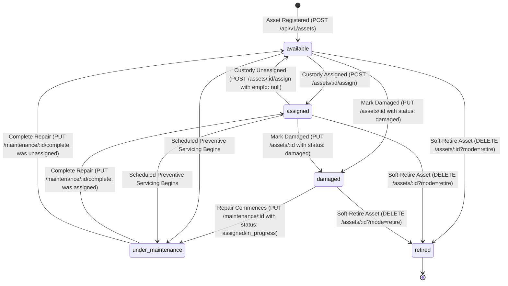

# 08. AssetIQ — Asset Custody & Maintenance Lifecycle

## 1. Asset Status State Machine (Option B Model)

---

## 2. Status Justifications & Database Triggers

### A. Status: `available`
- **What it means:** Asset is stored in stock, unassigned, fully functional, and ready for deployment.
- **Trigger API:** Created via `POST /api/v1/assets` OR unassigned via `POST /assets/:id/assign` OR restored after repair completion if `asset.assignedTo` is null.

### B. Status: `assigned`
- **What it means:** Asset is currently held in custody by an employee.
- **Trigger API:** Assigned via `POST /api/v1/assets/:id/assign` (updates `asset.assignedTo` and logs entry in `AssetAssignment`).

### C. Status: `damaged`
- **What it means:** Asset is reported broken by an employee or manager, awaiting technician pickup.
- **Trigger API:** Updated via `PUT /api/v1/assets/:id` with `{ status: 'damaged' }`.
- **Automated Side-Effect:** Backend checks for existing active tickets; if none exist, it auto-generates a high-priority open corrective `MaintenanceRequest`.

### D. Status: `under_maintenance`
- **What it means:** Asset is actively undergoing repair or preventive servicing by a technician.
- **Trigger API:** Updated via `PUT /api/v1/maintenance/:id` when ticket status changes to `'assigned'` or `'in_progress'`.

### E. Status: `retired`
- **What it means:** Asset has reached end-of-life, disposed of, or sold.
- **Trigger API:** Updated via `DELETE /api/v1/assets/:id?mode=retire`.
- **Hard-Delete Protection Guard:** Permanent deletion (`DELETE /api/v1/assets/:id`) is blocked if historical records exist in `MaintenanceRequest`, `MaintenanceHistory`, `Warranty`, or `AssetAssignment`.
