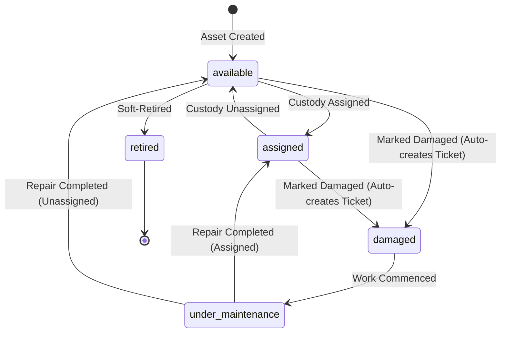

# 08. AssetIQ — Core Feature Flows & State Lifecycles

## 1. Option B Asset Lifecycle Rules
1. **Reporting Damage:** Marking an asset as damaged retains `asset.status = 'damaged'` and auto-creates an open corrective `MaintenanceRequest`.
2. **Work Commenced Trigger:** Updating the ticket status to `'assigned'` or `'in_progress'` automatically moves `asset.status` to `'under_maintenance'`.
3. **Repair Resolution (`completeMaintenance`):** Resolving the ticket restores `asset.status` to `'assigned'` (if `asset.assignedTo` exists) or `'available'` (if unassigned).
4. **Hard-Delete Guard:** Permanent deletion is blocked if records exist in `MaintenanceRequest`, `MaintenanceHistory`, `Warranty`, or `AssetAssignment`. Assets must be soft-retired (`status = 'retired'`).

---

## 2. Maintenance Servicing & WebSocket Chat Flow
1. User creates or opens a maintenance request ticket.
2. Clicking the chat icon opens `MaintenanceChatDrawer.jsx`.
3. The drawer queries `GET /api/v1/maintenance/:id/messages` for REST history and emits `chat:join` over Socket.IO.
4. Socket.IO verifies JWT credentials and joins room `chat:request:<requestId>`.
5. Sending a message saves a `MaintenanceMessage` document and broadcasts `chat:message` to all room listeners in real time.

---

## 3. Employee Offboarding & Asset Recovery
1. Admin clicks "Delete Employee" in `OrganizationSetup.jsx`.
2. Backend intercepts the delete request if `Asset.exists({ assignedTo: empId })` returns true, returning a `400 Bad Request`.
3. Frontend catches the 400 error and opens `OffboardingChecklistModal.jsx` displaying the assigned assets.
4. Admin clicks "Return All Assets to Stock", firing `POST /api/v1/offboarding/:empId/return-all`.
5. Backend unassigns assets, updates status to `'available'`, logs returned timestamp in `AssetAssignment`, and automatically fires `DELETE /api/v1/lookups/employees/:empId`.
