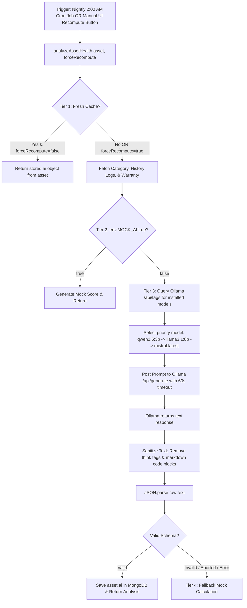

# 09. AssetIQ — AI Health Scoring & Predictive Analytics Engine

## 1. AI Engine Architecture & 4-Tier Execution Pipeline

The AI Service ([`src/services/ai.service.js`](file:///C:/Projects/AssetIQ/assetiq-backend/src/services/ai.service.js)) delivers privacy-first predictive health scoring using local Ollama LLMs (`qwen2.5:3b` / `llama3.1:8b`).

---

## 2. Deep Dive: The 4 Tiers & Fallback Architecture (The 10 Master Questions)

### A. Local Ollama LLM Inference & 60s Abort Timeout
1. **What is it?** An on-premise AI inference module querying a local Ollama instance over HTTP (`POST /api/generate`).
2. **Why is it needed?** Calculates 0-100 health scores, failure risk probabilities, and remaining useful life (RUL) in months without external cloud dependencies.
3. **Why was this approach chosen?** Guarantees zero sensitive corporate inventory data leaves company servers and incurs zero per-token cloud API billing.
4. **What problem does it solve?** Solves data privacy risks and cloud LLM latency/cost inflation.
5. **What would happen if this didn't exist?** Organization asset telemetry would have to be sent to external cloud APIs (e.g. OpenAI).
6. **How does it interact with the rest of the system?** Triggered manually via `POST /api/v1/ai/recompute/:id` or automatically via the nightly 2:00 AM cron job (`healthScore.job.js`).
7. **Advantages:** Total data privacy, zero API costs, flexible prompt engineering.
8. **Disadvantages:** Depends on local machine hardware (GPU/CPU) for inference speed.
9. **Common Mistakes:** Setting an overly tight HTTP abort timeout (e.g. 12s), which prematurely aborts local LLM inference (taking 15-18s) and forces mock fallbacks.
10. **Interview Question:** *How do you build a robust fallback strategy when integrating local LLM inferences into REST APIs?*  
    *Answer:* Implement a multi-tiered fallback pipeline: check fresh cache first, set an appropriate abort timeout (60s), sanitize output text (strip `<think>` tags/markdown), and catch any execution/timeout errors gracefully to return a deterministic fallback calculation without failing the API with a 500 error.
