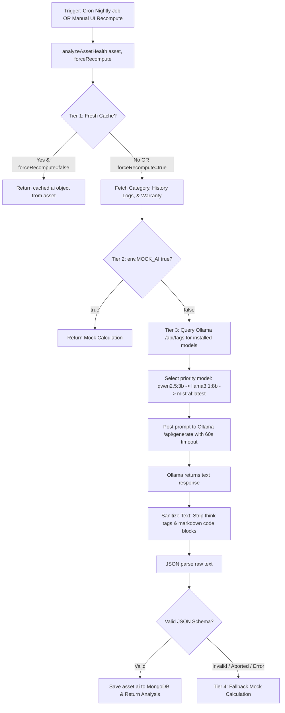

# 10. AssetIQ — AI Health Scoring & Predictive Analytics Engine

## Overview & Architecture
The AssetIQ AI Engine ([`src/services/ai.service.js`](file:///C:/Projects/AssetIQ/assetiq-backend/src/services/ai.service.js)) provides on-premise, privacy-first predictive health scoring for physical assets using local Ollama LLMs (`qwen2.5:3b` / `llama3.1:8b`).



---

## 4-Tier Execution & Fallback Decision Tree
1. **Tier 1 — Cache Check:** If the asset has an existing AI analysis generated within the last 24 hours and `forceRecompute = false`, the service returns cached results immediately.
2. **Tier 2 — Mock Environment Flag:** If `MOCK_AI=true` is enabled in `.env`, the system runs a deterministic mathematical algorithm for offline testing without local GPU hardware.
3. **Tier 3 — Live Ollama LLM Inference:** pings `OLLAMA_URL/api/generate` using dynamic model priority selection (`qwen2.5:3b` -> `llama3.1:8b`) with a **60-second timeout** (`60000` ms). Response text is sanitized via regex (`replace(/<think>[\s\S]*?<\/think>/gi, '')`) before parsing.
4. **Tier 4 — Graceful Failover:** If Ollama is unreachable or times out, the engine catches the exception and returns a fallback score without crashing the Express server with a 500 error.

---

## JSON Prompt Construction Strategy
The prompt instructs the local LLM to return strict, unformatted JSON:
```
Analyze the health, failure risk, and remaining useful life of THIS SPECIFIC asset:
Asset: MacBook Pro M3 Max
Code: AST-LAP-001
Category: Laptops
Current Status: assigned
Age: 1.5 years
Purchase Price: $3499
Warranty Details: {"provider":"AppleCare","status":"active"}
Total Maintenance Events: 2

Return ONLY a JSON object with this exact structure:
{
  "healthScore": <integer 0-100>,
  "failureRiskPercent": <integer 0-100>,
  "predictedNextMaintenanceDays": <integer>,
  "remainingUsefulLifeMonths": <integer>,
  "replacementRecommendation": "<sentence>",
  "priority": "<Low|Medium|High|Critical>",
  "insights": ["<observation 1>", "<observation 2>"]
}
```
