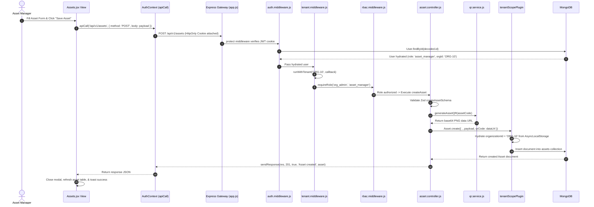
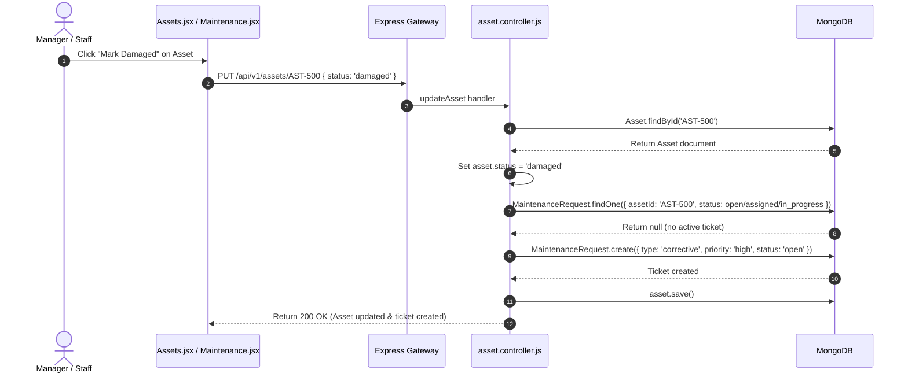

# 13. AssetIQ — End-to-End Request Lifecycles & Traces

## 1. Asset Registration Request Flow

```mermaid
sequenceDiagram
    autonumber
    actor User as Asset Manager
    participant React as Assets.jsx View
    participant AuthCtx as AuthContext (apiCall)
    participant Express as Express Gateway (app.js)
    participant AuthMW as auth.middleware.js
    participant TenantMW as tenant.middleware.js
    participant RBAC as rbac.middleware.js
    participant Ctrl as asset.controller.js
    participant QR as qr.service.js
    participant Plugin as tenantScopePlugin
    participant DB as MongoDB

    User->>React: Fill Asset Form & Click "Save Asset"
    React->>AuthCtx: apiCall('/api/v1/assets', { method: 'POST', body: payload })
    AuthCtx->>Express: POST /api/v1/assets (HttpOnly Cookie attached)
    Express->>AuthMW: protect middleware verifies JWT cookie
    AuthMW->>DB: User.findById(decoded.id)
    DB-->>AuthMW: User hydrated (role: 'asset_manager', orgId: 'ORG-10')
    AuthMW->>TenantMW: Pass hydrated user
    TenantMW->>TenantMW: runWithTenant('ORG-10', callback)
    TenantMW->>RBAC: requireRole('org_admin', 'asset_manager')
    RBAC->>Ctrl: Role authorized -> Execute createAsset
    Ctrl->>Ctrl: Validate Zod createAssetSchema
    Ctrl->>QR: generateAssetQR(assetCode)
    QR-->>Ctrl: Return base64 PNG data URL
    Ctrl->>Plugin: Asset.create({ ...payload, qrCode: dataUrl })
    Plugin->>Plugin: Hydrate organizationId = 'ORG-10' from AsyncLocalStorage
    Plugin->>DB: Insert document into assets collection
    DB-->>Ctrl: Return created Asset document
    Ctrl-->>AuthCtx: sendResponse(res, 201, true, 'Asset created', asset)
    AuthCtx-->>React: Return response JSON
    React->>React: Close modal, refresh asset table, & toast success
```

---

## 2. Option B Damaged Asset & Maintenance Request Flow

```mermaid
sequenceDiagram
    autonumber
    actor User as Manager / Staff
    participant React as Assets.jsx / Maintenance.jsx
    participant Express as Express Gateway
    participant Ctrl as asset.controller.js
    participant DB as MongoDB

    User->>React: Click "Mark Damaged" on Asset #AST-500
    React->>Express: PUT /api/v1/assets/AST-500 { status: 'damaged' }
    Express->>Ctrl: updateAsset handler
    Ctrl->>DB: Asset.findById('AST-500')
    DB-->>Ctrl: Return Asset document
    Ctrl->>Ctrl: Set asset.status = 'damaged'
    Ctrl->>DB: MaintenanceRequest.findOne({ assetId: 'AST-500', status: open/assigned/in_progress })
    DB-->>Ctrl: Return null (no active ticket)
    Ctrl->>DB: MaintenanceRequest.create({ type: 'corrective', priority: 'high', status: 'open' })
    DB-->>Ctrl: Ticket created
    Ctrl->>DB: asset.save()
    Ctrl-->>React: Return 200 OK (Asset updated & ticket created)
```
