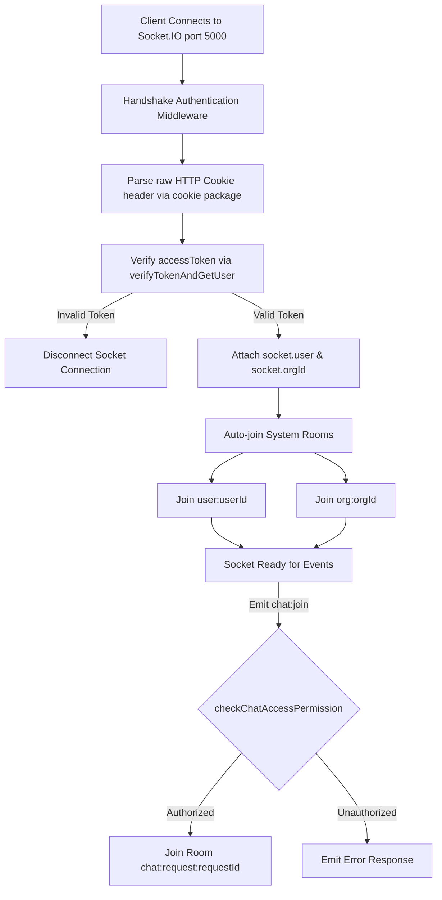
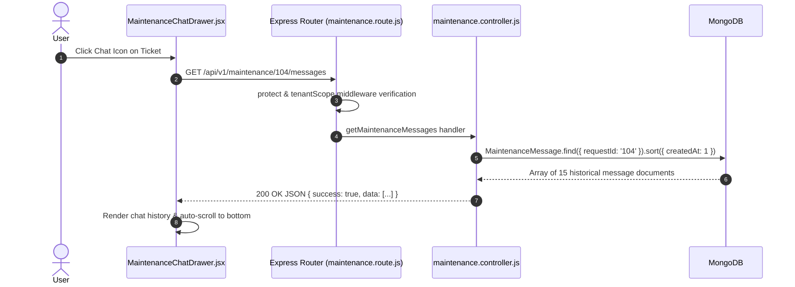
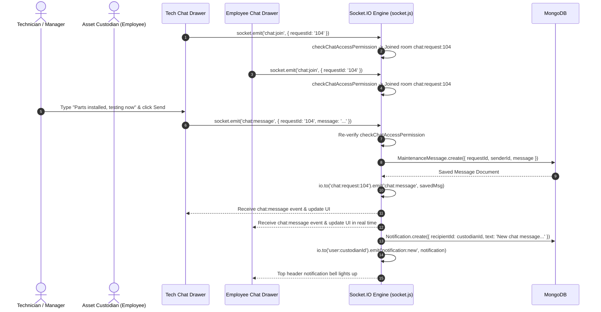

# 16. AssetIQ — Real-Time Maintenance Chat System

## 1. Executive Summary & Purpose
The **Real-Time Maintenance Chat System** enables live, ticket-isolated communication between equipment custodians (Employees), fleet supervisors (Asset Managers), and technicians directly within servicing tickets.

It combines **Socket.IO WebSockets** for instant bidirectional message delivery with **MongoDB persistent storage** (`maintenancemessages` collection) and **REST HTTP endpoints** for fetching historical chat logs.

---

## 2. Where & How Messages Are Stored

### Database Collection: `maintenancemessages`
- **Mongoose Model File:** [`assetiq-backend/src/models/MaintenanceMessage.js`](file:///C:/Projects/AssetIQ/assetiq-backend/src/models/MaintenanceMessage.js)
- **Schema Fields:**

| Field Name | BSON Type | Constraints & References | Purpose |
| :--- | :--- | :--- | :--- |
| `_id` | ObjectId | Primary Key | Unique message identifier. |
| `organizationId` | String | Indexed via `tenantScopePlugin` | Enforces multi-tenant data isolation. |
| `requestId` | ObjectId | ref `MaintenanceRequest` (Required, Indexed) | Binds message to specific servicing ticket. |
| `senderId` | ObjectId | ref `User` (Required) | User who sent the message. |
| `message` | String | Required | Plain text message body. |
| `attachments` | Array | Objects `{ url, name, fileType }` | Optional image or document attachments. |
| `createdAt` | Date | Auto-timestamp (Indexed) | Timestamp used for chronological sorting. |

### Indexing Strategy
A compound index is established on `{ requestId: 1, createdAt: 1 }` so historical chat logs for any servicing ticket can be retrieved in chronological order in under 5 milliseconds.

### Sample MongoDB Document:
```json
{
  "_id": "6a651001ed1a95055efac123",
  "organizationId": "6a607f38b61b9a8bae9c49e8",
  "requestId": "6a62a110ed1a95055efa7b22",
  "senderId": "6a607f38b61b9a8bae9c49eb",
  "message": "Replacement fan motor has arrived. Starting repair now.",
  "attachments": [],
  "createdAt": "2026-07-31T11:45:00.000Z",
  "updatedAt": "2026-07-31T11:45:00.000Z"
}
```

---

## 3. WebSockets Architecture & Room Isolation

Real-time communication is managed in [`assetiq-backend/src/config/socket.js`](file:///C:/Projects/AssetIQ/assetiq-backend/src/config/socket.js).



### Room Architecture Strategy
1. **User Private Room (`user:<userId>`):** Target for personal push notifications (e.g. ticket assignments, chat mentions).
2. **Organization Room (`org:<orgId>`):** Target for tenant-wide announcements.
3. **Ticket Chat Room (`chat:request:<requestId>`):** Isolated, RBAC-guarded channel for ticket-specific messaging.

---

## 4. Chat Security & Access Control (`checkChatAccessPermission`)

Before allowing a socket connection to join a chat room or broadcast messages, `socket.js` executes `checkChatAccessPermission(socket, requestId)`:

1. **Tenant Scope Check:** Fetches `MaintenanceRequest` ensuring `organizationId === socket.orgId`.
2. **Role Authorization:**
   - **`super_admin`**, **`org_admin`**, **`asset_manager`**: Granted immediate access to any ticket within their organization.
   - **`employee`**: Granted access **ONLY IF** they created the ticket (`request.raisedBy === user._id`) or hold custody of the underlying asset (`asset.assignedTo === user._id`).

---

## 5. End-to-End Execution Flow Diagrams

### A. Initial Chat History Load (REST HTTP Flow)



---

### B. Sending & Receiving a Real-Time Message (WebSocket Flow)



---

## 6. Frontend Component Architecture ([`MaintenanceChatDrawer.jsx`](file:///C:/Projects/AssetIQ/assetiq-frontend/src/components/MaintenanceChatDrawer.jsx))

```javascript
// Key React Lifecycle Hook inside MaintenanceChatDrawer.jsx
useEffect(() => {
  if (!isOpen || !requestId) return;

  // 1. Fetch REST historical messages
  fetchMessages();

  // 2. Join WebSocket chat room
  if (socket) {
    socket.emit('chat:join', { requestId });

    // 3. Listen for incoming real-time messages
    const handleIncomingMessage = (newMessage) => {
      if (newMessage.requestId === requestId) {
        setMessages((prev) => [...prev, newMessage]);
        scrollToBottom();
      }
    };

    socket.on('chat:message', handleIncomingMessage);

    // 4. Cleanup listener on drawer unmount
    return () => {
      socket.off('chat:message', handleIncomingMessage);
    };
  }
}, [isOpen, requestId, socket]);
```

---

## 7. The 10 Master Architectural Questions (Chat System)

1. **What is it?** A hybrid WebSockets & REST messaging subsystem for ticket-based communication.
2. **Why is it needed?** Allows staff and technicians to collaborate on repairs without leaving the application.
3. **Why was this approach chosen?** Socket.IO provides instant real-time message delivery over WebSockets, while MongoDB ensures messages are permanently saved and accessible later via REST APIs.
4. **What problem does it solve?** Solves delayed communication and eliminates costly HTTP long-polling overhead.
5. **What would happen if this didn't exist?** Users would be forced to refresh the page constantly to check for updates or use external email/messaging tools.
6. **How does it interact with the rest of the system?** Connects to `socket.js`, queries `MaintenanceMessage` and `MaintenanceRequest` models, and triggers `Notification` events.
7. **Advantages:** Sub-50ms message latency, room-based security isolation, permanent database audit trial.
8. **Disadvantages:** Requires maintaining an active WebSocket connection and handling network disconnect/reconnect logic on mobile browsers.
9. **Common Mistakes:** Forgetting to call `socket.off('chat:message')` on unmount, causing memory leaks and duplicate message renders.
10. **Interview Question:** *How do you secure WebSockets communication in a multi-tenant application?*  
    *Answer:* Authenticate the initial WebSocket handshake using `HttpOnly` JWT cookies, extract user identity into the socket instance, and require permission checks (`checkChatAccessPermission`) before allowing sockets to join isolated rooms (`chat:request:<requestId>`).
