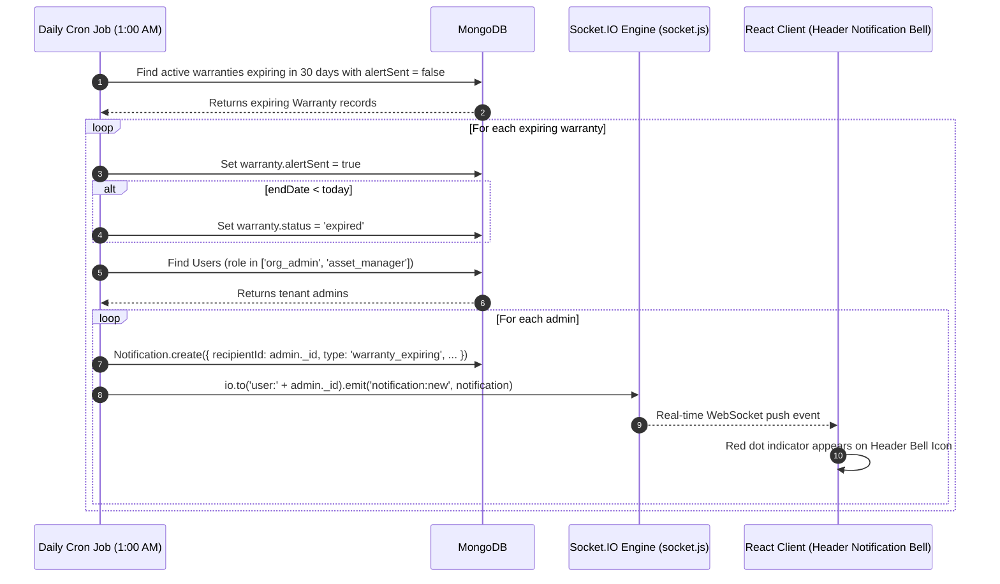

# 17. AssetIQ — Warranty Tracking & Automated Expiration Alerts Guide

## 1. Executive Summary & Overview
The **Warranty Tracking & Automated Alert System** manages physical hardware warranty policies (AppleCare, Dell ProSupport, HP Care Pack), tracks expiration dates, and alerts administrators before coverage lapses.

It combines an automated **nightly background cron job** (`warrantyAlert.job.js`), **Socket.IO push notifications**, **MongoDB schema indexes**, and **on-demand REST APIs**.

---

## 2. Warranty Data Schema & Database Storage

### Collection: `warranties`
- **Mongoose Model File:** [`assetiq-backend/src/models/Warranty.js`](file:///C:/Projects/AssetIQ/assetiq-backend/src/models/Warranty.js)
- **Schema Fields:**

| Field Name | Type | Constraints | Purpose |
| :--- | :--- | :--- | :--- |
| `_id` | ObjectId | Primary Key | Unique warranty record identifier. |
| `organizationId` | String | Scoped via `tenantScopePlugin` | Multi-tenant data isolation. |
| `assetId` | ObjectId | ref `Asset`, `required`, `unique` | Enforces 1-to-1 policy link per hardware asset. |
| `provider` | String | Required | Coverage vendor (e.g. AppleCare, Dell ProSupport). |
| `startDate` | Date | Required | Start date of warranty coverage. |
| `endDate` | Date | Required, Indexed | End date of warranty coverage. |
| `status` | String | enum: `['active', 'expired', 'void']` | Current policy status. |
| `alertSent` | Boolean | default: `false` | Prevents duplicate alert spamming across cron runs. |

### Indexing Strategy
`warrantySchema.index({ organizationId: 1, endDate: 1 });`  
Enforces fast querying for tenant-specific expiration dates.

---

## 3. How Expiration is Calculated (30-Day Lookahead)

The system calculates a **30-Day Lookahead Window**:

$$\text{thirtyDaysFromNow} = \text{today} + 30 \text{ days}$$

```javascript
const today = new Date();
const thirtyDaysFromNow = new Date();
thirtyDaysFromNow.setDate(today.getDate() + 30);

// Find active warranties expiring within 30 days that have not sent an alert
const expiringWarranties = await Warranty.find({
  endDate: { $gte: today, $lte: thirtyDaysFromNow },
  status: 'active',
  alertSent: false,
});
```

---

## 4. Automated Nightly Cron Job (`warrantyAlert.job.js`)

- **Cron Schedule:** Runs daily at **01:00 AM** (`cron.schedule('* 0 * * *')`).
- **File:** [`assetiq-backend/src/jobs/warrantyAlert.job.js`](file:///C:/Projects/AssetIQ/assetiq-backend/src/jobs/warrantyAlert.job.js)



---

## 5. REST API Endpoints (`/api/v1/warranties`)

| Method | Endpoint Path | Roles Allowed | Purpose |
| :--- | :--- | :--- | :--- |
| `GET` | `/api/v1/warranties` | All Roles | Lists all warranty policies for the tenant. |
| `POST` | `/api/v1/warranties` | `org_admin`, `asset_manager` | Links a new warranty policy to an asset. |
| `PUT` | `/api/v1/warranties/:id` | `org_admin`, `asset_manager` | Updates warranty provider or coverage dates. |
| `DELETE` | `/api/v1/warranties/:id` | `org_admin`, `asset_manager` | Removes a warranty record. |
| `GET` | `/api/v1/warranties/expiring` | All Roles | Fetches policies expiring within the next 30 days. |

---

## 6. The 10 Master Architectural Questions (Warranty System)

1. **What is it?** An automated background job and REST subsystem tracking hardware warranty policies and alerting staff before coverage expires.
2. **Why is it needed?** Prevents out-of-warranty repair costs by alerting managers to extend policies or repair devices before coverage lapses.
3. **Why was this approach chosen?** Node-cron runs automated daily checks without manual user intervention, while `alertSent: false` prevents alert spamming.
4. **What problem does it solve?** Solves missed warranty expiration dates and unexpected hardware repair bills.
5. **What would happen if this didn't exist?** Managers would have to manually check spreadsheet expiration dates for every hardware asset.
6. **How does it interact with the rest of the system?** Connects `Warranty` to `Asset`, generates `Notification` documents, emits Socket.IO push events, and supplies telemetry to the AI engine (`ai.service.js`).
7. **Advantages:** Zero-maintenance automated scanning, real-time push alerts, 1-to-1 asset binding.
8. **Disadvantages:** Depends on accurate initial entry of `endDate` during asset registration.
9. **Common Mistakes:** Omitting the `alertSent: true` update, which causes the cron job to send duplicate notifications every single night.
10. **Interview Question:** *How do you prevent duplicate alert notifications in automated cron jobs?*  
    *Answer:* Include a Boolean flag (`alertSent: false`) in the query filter and update it to `true` within a transaction/write immediately after generating the first alert payload.
